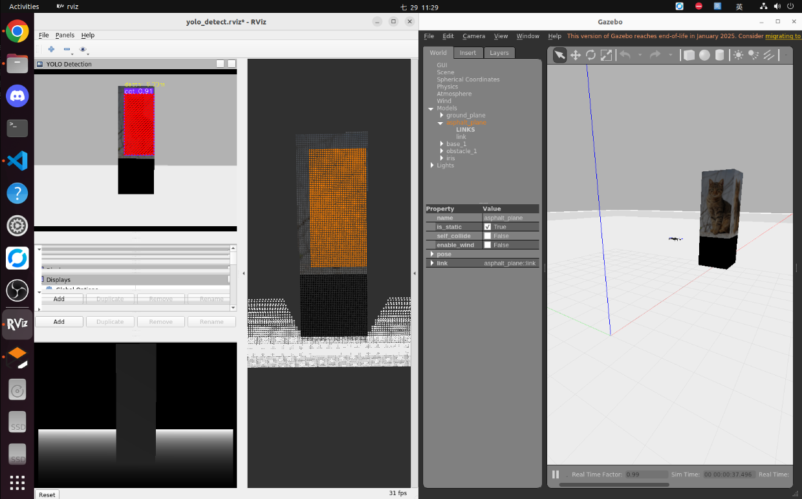

# Gazebo 虛擬環境修改

這是針對 [官方範例](https://github.com/FCWTW/Flight-Control/blob/master/Gazebo/README_PX4.md) 所建立的環境進行修改，PX4 是放在根目錄 『~/PX4-Autopilot』，同時已經建好 offboard package 『/catkin_ws/src/offboard_py』。

---
## 改善地板材質

1. 將[『asphalt.material』](https://github.com/FCWTW/Flight-Control/blob/master/Gazebo/asphalt.material)複製到『~/PX4-Autopilot/Tools/simulation/gazebo-classic/sitl_gazebo-classic/models/asphalt_plane/materials/scripts/asphalt.material』
2. 將『/usr/share/gazebo-11/media/materials/scripts/gazebo.material』中的 Gazebo/Grey 改成以下的樣子：
```python
material Gazebo/Grey
{
  technique
  {
    pass main
    {
      scene_blend alpha_blend
      depth_write off
      ambient 1.0 1.0 1.0 0.5
      diffuse 1.0 1.0 1.0 0.5
      specular 0.01 0.01 0.01 0.5 1.500000
    }
  }
}
```

---
## 幫無人機加裝 RGBD 相機

1. 將[『iris.sdf.jinja』](https://github.com/FCWTW/Flight-Control/blob/master/Gazebo/iris.sdf.jinja)複製到『~/PX4-Autopilot/Tools/simulation/gazebo-classic/sitl_gazebo-classic/models/iris/iris.sdf.jinja』
(『iris.sdf.jinja』第 581 行開始是相機的設置，可以自行修改視野角度和可視距離)
2. 刪除相同資料夾下的『iris.sdf』
3. 執行以下指令重新生成無人機
```bash
cd ~/PX4-Autopilot
DONT_RUN=1 make px4_sitl_default gazebo-classic_iris
```
4. 測試無人機是否有 RGBD 相機
```bash
roslaunch px4 posix_sitl.launch
```

Reference: [ViniciusAbrao/px4_ros2_xrcedds](https://github.com/ViniciusAbrao/px4_ros2_xrcedds?tab=readme-ov-file#rgbd-camera-simulation)、[Iris model with RGBD camera in Gazebo and ROS Noetic](https://www.youtube.com/watch?v=PpW_qEyGmyM)

---
## 簡易障礙物

1. 將[『empty.world』](https://github.com/FCWTW/Flight-Control/blob/master/Gazebo/empty.world)複製到『~/PX4-Autopilot/Tools/simulation/gazebo-classic/sitl_gazebo-classic/worlds/empty.world』
2. 將[『materials』](https://github.com/FCWTW/Flight-Control/tree/master/Gazebo/materials)整個複製到『~/PX4-Autopilot/Tools/simulation/gazebo-classic/sitl_gazebo-classic/』底下。

Reference: [HKPolyU-UAV/E2ES](https://github.com/HKPolyU-UAV/E2ES)

---
## 整合 YOLO 與 offboard 程式

1. offboard package 有修改過的程式碼放在 [這裡](https://github.com/FCWTW/Flight-Control/tree/master/offboard_py)
2. 使用以下指令測試
```bash
# 測試 OFFBOARD
roslaunch offboard_py start_offb.launch

# 測試 OFFBOARD 與 YOLO 偵測
roslaunch offboard_py fly.launch

# 測試 AUTO.MISSION
roslaunch offboard_py start_auto.launch
```

3. OFFBOARD 模式結合 YOLO 偵測的測試結果如下圖所示：畫面右側為 Gazebo 虛擬環境，左側顯示回傳的 RGB 影像、點雲及深度影像。其中，RGB 影像除了顯示物件偵測框外，亦標示了對應的物件深度資訊。


Reference: [YOLO Detect](https://hackmd.io/lwReki-hQTCrnzUMYMq2yA?view)
